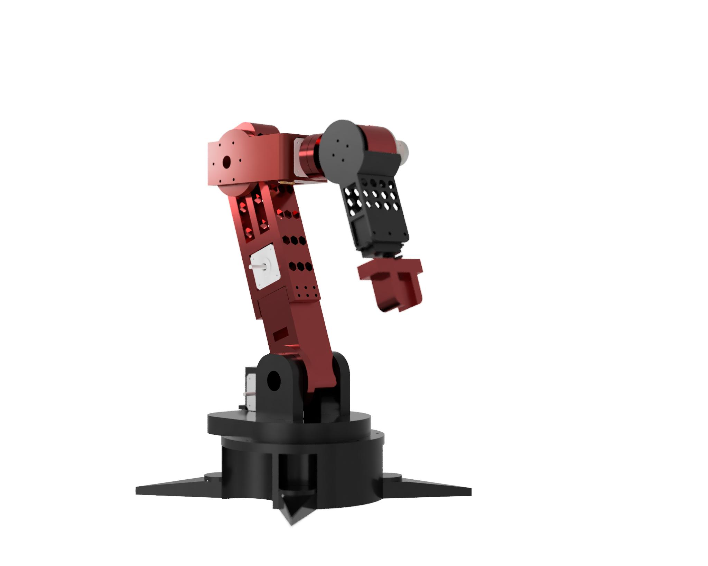

# CHIMAERA---Open-source-6-DOF-Robotic-arm

Multi-joint articulated manipulator designed for precision movement and small-scale automation, experimentation, and learning advanced control.

  
  

# Degrees of Freedom (DOF): 6 DOF 

Segments:

Base Rotation: Provides 360° rotation using a NEMA 17 stepper or high-torque servo.

Shoulder Joint: Actuated using a NEMA 17 stepper with a 5:1 gear reduction, allowing smooth lifting and positioning.

Elbow Joint: Controlled by an NEMA 17, providing stable controlled movement within a physical range of -30° to +60° from horizontal.

Wrist Joint: MG996R servo, and NEMA 17 capable of up to 360° rotation or constrained movement for orientation control.

Gripper: MG996R Servo-powered for object holding.

  

components:
| **Category**          | **Component**                                       |
| --------------------- | --------------------------------------------------- | 
| **Structure**         | PLA linkages                                        | 
| **Actuators**         | **Base rotation:** NEMA 17 stepper                  | 
|                       | **Shoulder joint:** NEMA 17 stepper                 |                            
|                       | **Elbow joint:**NEMA 17 stepper                      |                       
|                       | **Wrist pitch:** NEMA 17 stepper                       |                           
|                       | **Gripper:**  MG995S                                 |                             
|                       | **Wrist rotation:** NEMA 17 stepper                                                            
| **Sensors**           | AS5600 magnetic encoder                             |                 
| **Electronics**       | Arduino Mega                                |                           
|                       | RAMPS + Stepper motor driver (A4988)       |                       
|                       | Buck converter (12V → 7V/6V)                         |                        
| **Power Supply**      | LiPo battery (3S)      |        
                      

